# TypeTorch docs

TypeTorch updates live Roblox games **without restarting their servers**. You write the game in
[roblox-ts](https://roblox-ts.com). Each build becomes one artifact (an uploaded, private Model asset), and every live
server hot-swaps to it in a few seconds while players stay in the game.

> **Status: early.** The core loop runs on live Roblox servers today. APIs and commands still change. These docs
> describe the code as it is now. Features that don't exist yet are marked **planned**.

> **No GitHub Actions, ever.** TypeTorch doesn't use or ship GitHub Actions or any hosted CI: they are a common
> supply-chain risk and would need your keys. Builds, cloud tests, signing and deploys run on your own machine.

## Get started

Pick one path:

| You have | Start here | Time |
|---|---|---|
| Nothing yet: a new game | **[Fresh setup](getting-started/fresh-setup.md)**: from zero to a live hot-swap | about 1 hour |
| A roblox-ts game | **[Migrate an existing game](getting-started/migrate.md)**: services, swap safety, networking, data, UI; with live players, inside the [go-live checklist](guides/go-live-checklist.md) | a few hours to days; about a week with live players |
| An AI coding agent | **[Agent playbook](agents/AGENTS.md)**: tell your agent "migrate this project to typetorch" | |

TypeTorch is **roblox-ts only**. A plain Luau game has to move to roblox-ts first.

## How it works

```mermaid
flowchart LR
    A[typetorch deploy] --> B[build: roblox-ts -> payload.rbxm]
    B --> C[upload as a private Model asset<br/>moderation check]
    C --> T[cloud test<br/>prod: always]
    T --> D[approve y/N<br/>prod: signed]
    D --> E[deploy message<br/>MessagingService]
    E --> F[live servers: the kernel loads the payload]
    F --> G[old version stops, new one starts<br/>server + clients, no restart]
    G --> R[reports to the fleet API<br/>bad build: automatic rollback]
```



- **Kernel:** a small Luau loader baked into the place. It picks each server's branch, loads payloads and swaps them.
  It is the only part that needs a place publish and a server restart to change.
- **Payload:** your compiled game code (ModuleScripts only), uploaded once per build.
- **Framework:** `@typetorch/framework`, the roblox-ts library your game uses: modules with dependency injection and
  lifecycle hooks, troves for cleanup, guarded networking, UI helpers, hot assets and the in-game dev menu. It ships
  inside every payload, so it hot-swaps too.
- **Branches:** public servers run `prod`. Any other branch (`dev`, `feature-x`) runs in private or reserved servers of
  the same game.
- **CLI:** `typetorch` builds, uploads, tests, approves, signs and deploys, rolls back, shows live servers and alerts,
  and patches the kernel into the place. `typetorch update` keeps it current.
- **Safe deploys:** a cloud test before every prod publish; on each server a health window that rolls a failing build
  back; `deploy --wait`, which rolls the branch back when a build fails on 20% of servers; a new server plays within
  15 s.
- **Fleet API and analytics (optional, self-hosted):** live server status, deploy reports and alerts from the kernel,
  and your own analytics with experiments, funnels and player journeys.

## Guides

| Guide | What it covers |
|---|---|
| [Branches and channels](guides/branches-and-channels.md) | `prod` and `dev`, private servers on a branch, `/tt new`, owners switching any server in place |
| [Deploy and rollback](guides/deploy-and-rollback.md) | deploy, approval, safe deploys (cloud test, health window, `--wait` and automatic rollback, reports), promote, rollback, pins, kernel updates |
| [Live servers and alerts](guides/fleet-and-alerts.md) | the fleet API, `typetorch servers`, `report`, `alerts`, server lost and stuck, webhooks |
| [Analytics](guides/analytics.md) | `AnalyticsEngine`, the event format, DuckDB or Basin, experiments, queries, node graphs, privacy, a local quick start |
| [Prod signing](guides/prod-signing.md) | the Root Key and Fallback Key, `typetorch keys`, kernel 0.3 verification, bootstrap heads, the boot fail-safe |
| [Player data](guides/player-data.md) | the swap-safe data pattern, with a ProfileStore example, the cloud test and developer product receipts |
| [Go-live checklist](guides/go-live-checklist.md) | moving a game with live players: prepare, a copy, a dev-branch soak, live tests, cut-over, what to do if it goes wrong |
| [Hot assets](guides/hot-assets.md) | models and UI templates from the place, updated live with `hotAsset()` |
| [Testing in Studio](guides/studio-testing.md) | run your local code in Studio with the real kernel |
| [The dev menu](guides/dev-menu.md) | every tab, owners and devs, the `/tt` commands |
| [Runtime API](guides/runtime-api.md) | `TypeTorch.*`: identity, start info, swap events, persist, roles, logs |
| [Networking](guides/networking.md) | `createNetwork`, guards, limits, requests |
| [remote-claude](guides/remote-claude.md) | prompt Claude Code from inside a dev server: Live and Code modes, screenshots, Toolbox |
| [Security model](guides/security.md) | who can do what, keys, signing, never publish secrets |
| [Troubleshooting](guides/troubleshooting.md) | real errors and their fixes |

## For agents

- [agents/AGENTS.md](agents/AGENTS.md): the migration and setup playbook for any coding agent (Claude Code, Codex,
  Cursor and others).
- [agents/skills/typetorch-migrate/SKILL.md](agents/skills/typetorch-migrate/SKILL.md): the same playbook as a Claude
  Code skill.
- Claude Code plugin (works once the `typetorch/claude-plugin` repo is on GitHub):

  ```text
  /plugin marketplace add typetorch/claude-plugin
  /plugin install typetorch@typetorch
  ```

  Then say "migrate this project to typetorch", or run `/typetorch:typetorch-migrate`.
- [llms.txt](llms.txt): an index of these docs for LLMs.

## Repositories

| Repository | What it is |
|---|---|
| [kernel](https://github.com/typetorch/kernel) | the Luau loader baked into the place |
| [framework](https://github.com/typetorch/framework) | `@typetorch/framework`, the roblox-ts framework (ships in every payload) |
| [cli](https://github.com/typetorch/cli) | `typetorch`, the command line tool |
| [template](https://github.com/typetorch/template) | the starter game (Target Rush), also the reference setup |
| [transformer](https://github.com/typetorch/transformer) | `@typetorch/transformer`, the compiler plugin for guards and dependency injection |
| [dev-server](https://github.com/typetorch/dev-server) | `remote-claude`: Claude Code on your PC, prompted from inside a dev server |
| [analytics](https://github.com/typetorch/analytics) | the analytics server (DuckDB), the fleet API (SQLite), the queries and `bun run report` (not on npm yet) |

## Conventions in these docs

- Commands work in PowerShell 5.1 and bash unless a block says otherwise.
- `bun run typetorch <command>` runs the CLI: `@typetorch/cli` from npm, in the game's dev dependencies with the
  script `"typetorch": "typetorch"` (the template has both; see
  [fresh setup](getting-started/fresh-setup.md#2-get-the-code)). Without it, `npx @typetorch/cli <command>` does the
  same.
- Ids in examples are fake: universe `1234567890`, place `9876543210`, group `1234567`, user `111111111`.

## License

MIT
