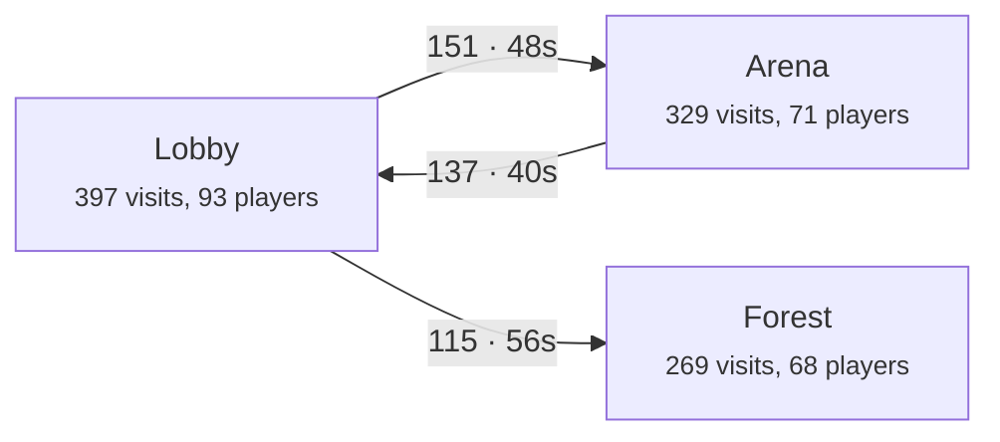

# Analytics

TypeTorch has its own analytics. It is optional and fully yours: your game logs what players do, your own backend
stores it, and you query it yourself. Roblox's analytics isn't used. Every event is labelled with the build (artifact)
that was live, so you can compare builds, experiments and devices.

- **Write side:** `AnalyticsEngine` in `@typetorch/framework` (0.3.0+), on the server and the client.
- **Backend, your choice:** a self-hosted **DuckDB server** (one small VPS), or **Cloudflare Basin** (no server).
- **Read side:** [`@typetorch/analytics`](https://github.com/typetorch/analytics) (a git repo, not on npm yet): the
  queries, the DuckDB server, the fleet API, `bun run report`.
- A web explorer is **coming** (in progress, not usable yet).

Contents: [Using it in a game](#using-it-in-a-game) · [What is collected](#what-is-collected) ·
[The event format](#the-event-format) · [Backends](#backends) · [Settings](#settings-the-typetorchanalytics-key) ·
[Experiments](#experiments) · [Queries](#queries) · [Node graphs](#node-graphs) · [bun run report](#bun-run-report) ·
[Privacy](#privacy-and-right-to-erasure) · [Quick start: a local test](#quick-start-a-local-test)

## Using it in a game

Nothing runs until you create an engine: no connections, threads or requests. Games that don't use it pay only the
module load.

```ts
// A server module (onInit)
import { AnalyticsEngine } from "@typetorch/framework";

const analytics = new AnalyticsEngine();
analytics.track(player, "quest_done", { quest: "tutorial" }); // anything custom
analytics.step(player, "onboarding", 3, "opened_shop"); // a funnel step: funnel, index, name
analytics.purchase(player, { product: 1234, robux: 99, where: "shop" }); // after the receipt is granted
analytics.currency(player, "coins", 50, "round_reward"); // economy: + in, - out
analytics.state("round"); // every player's activity; analytics.state(player, "shop") for one
const variant = analytics.experiment(player, "onboarding", ["short", "long"]); // the first is the control
```

```ts
// A client controller (onStart): everything goes through the server, never to the internet
const analytics = new AnalyticsEngine();
analytics.track("opened_map");
analytics.screen("Inventory"); // for UIs that aren't separate ScreenGuis
const variant = analytics.experiment("onboarding", ["short", "long"]); // the same answer as the server's
```

- **One engine per generation and realm.** Every `new AnalyticsEngine()` joins the one already running (the first
  one's options win), so any module can create its own. It stops with the generation. Unsent rows wait in `persist`
  and the next generation sends them, so a hot swap loses nothing.
- **Server calls take the player first.** Without a player, an event is server-only (no player id).
- **Client calls** are about the local player. They are marked `src = "client"` (a client can lie), and the server
  checks their shape, size (props at most 4 KB) and rate (120 a minute, 5,000 a session; a client's experiment calls
  count too). `purchase` and `currency` are server-only (revenue and the economy are server-authoritative): on the
  client they warn once and send nothing, and both the game server and the analytics server refuse them from clients.
- **Revenue counts server-sent purchases only.** Payers and Robux come from `purchase` rows the server sent. Clients
  can't send `purchase` or `currency` at all (framework after 0.3.2; older engines' client rows are refused at ingest
  and never counted). Rows from before `src` existed still count. Call `analytics.purchase` on the server, after the
  receipt is granted.
- **The cloud test sends nothing** (framework after 0.3.2). In `typetorch test --cloud` (before every prod deploy)
  the engine collects as usual but never uploads: no event rows, no identity rows, no HTTP request. A prod deploy
  never adds a fake server session.
- **Options** (all on by default): `sessions`, `tech`, `zones`, `screens`, `recording`, `fleet`. `settings` (server
  only) replaces the [settings key](#settings-the-typetorchanalytics-key), for tests.
- `analytics.stats()` (server) returns the counters (queued, sent, dropped, refused); `analytics.flush()` sends soon.
- In edit mode (UI Labs stories) it is inert.
- The template has a complete example: `AnalyticsService` (server) and `AnalyticsController` (client).
- Game settings: **Allow HTTP Requests** must be on (Game Settings > Security).

## What is collected

**On every event:** the time, a random player id (never the UserId), the session, the server (JobId, type, place),
the build (artifact id, `#seq`, branch, channel), the device, new vs returning, the player's experiment variants, and
the player's state (`zone:Lobby|screen:Shop|activity:round`).

**Automatic (the same in every game):**

| Group | Option | Events |
|---|---|---|
| Sessions | `sessions` | join and leave, session length, where they came from (direct, teleport, friend follow, share link...), device and input type, screen size, account age bucket, Premium, country, friends in the server (one friend-list lookup per join), first visit or returning, days since the last visit |
| Tech health | `tech` | server FPS and heartbeat, client FPS, ping, memory, load time, client and server errors, hot swaps and rollbacks, and who left within 60 s of a swap |
| Zones | `zones` | entering and leaving zones: parts or models tagged `TTZone` in the place, named by a `Name` attribute or the instance name. The smallest zone around the player wins |
| Screens | `screens` | ScreenGuis in PlayerGui, and GuiObjects tagged `TTScreen` |
| First session | `recording` | [below](#the-first-ever-session-recorded-in-detail) |
| Fleet | `fleet` | each server's status and deploy reports from the kernel, for history ([Fleet and alerts](fleet-and-alerts.md) is the live view) |

**From your code (game-specific):** funnels such as onboarding (`step`), purchases (`purchase`), currency in and out
(`currency`), activities (`state`), and anything custom (`track`).

**Never collected:** chat or anything typed, usernames and display names (error texts have them replaced with
`<player>`), UserIds.

### The first-ever session, recorded in detail

Only a player's first session in the game is recorded, from the start until 60 s after their first input (at most 10
minutes). About 10 times a second it samples the character position and facing and the camera. It also records each
input (key, click, tap, gamepad button, thumbstick), each button pressed or hovered (by path, e.g.
`Shop/Buy/Coins100`), screens opened and closed, proximity prompts, deaths and spawns, and your own `track()` events in
that window.

- Keys are never recorded while a TextBox or the chat has focus. A text box only says which box was used, never its
  text.
- It is packed into small binary chunks (`tt-rec-1`): about 10-20 KB per new player, sent through the server.
- `recordShare` (0 to 1) in the settings picks the share of new players who are recorded (stable per player). Turn it
  down first when volume spikes.

## The event format

Two tables of flat JSON rows. Every column is always present: a missing value is `""`, `0` or `false`. The full
contract, with every event and its props, is
[SCHEMA.md](https://github.com/typetorch/framework/blob/main/src/analytics/SCHEMA.md) in the framework.

**events:**

| Column | Meaning |
|---|---|
| `v` | format version, `1` |
| `t` | unix ms, on the game server's clock (client events are corrected) |
| `kind` | `session`, `tech`, `zone`, `funnel`, `purchase`, `currency`, `state`, `experiment`, `custom`, `recording_meta`, `fleet` |
| `name` | the event name (1-64 characters) |
| `pid`, `sid` | random player id and session id (`""` on server-only events) |
| `job`, `srv`, `place` | JobId, server type (`public`, `private`, `reserved`, `studio`), PlaceId |
| `art`, `seq`, `branch`, `channel` | the build that was live |
| `dev` | `desktop`, `phone`, `tablet`, `console`, `vr`, `unknown` |
| `newp` | part of the player's first-ever session |
| `state` | the player's state after the event, `zone:<z>\|screen:<s>\|activity:<a>` |
| `exp` | the player's experiments as JSON, `{"onboarding":"short"}` |
| `sexp` | the server's experiment: the artifact id of an A/B pin, or `""` |
| `src` | `server` or `client` |
| `props` | the event's own data as JSON text, at most 4096 bytes |

**recordings** (first sessions): `v`, `t`, `pid`, `sid`, `job`, `art`, `chunk`, `codec` (`tt-rec-1`), `data`
(base64), `n`.

Delivery is at least once: a hot swap during a request sends that batch again. The DuckDB server drops exact
duplicates when it writes each day's file.

## Backends

The game speaks one event format. An adapter on each side translates it for the backend you pick: the framework's
sink writes (`basin` or `duckdb`), and the read side's store renders each query as SQL for that backend.

| | DuckDB server | Cloudflare Basin |
|---|---|---|
| What you run | one Bun process on a small VPS (1 GB is enough) | nothing: Cloudflare's pipelines into Iceberg tables on R2 |
| Ingest | gzip batches, appended to raw files first | JSON arrays to two stream endpoints |
| Delay | seconds | one roll interval (60 s minimum; expect 1-2 minutes) |
| Queries | `bun run report`, the HTTP API, `createStore` | `createStore` (Basin SQL, read-only) |
| Deleting a player's rows | yes | no (rows become anonymous) |
| Live server status | the fleet API runs in the same process | run the fleet API alone (`TT_SERVER_PARTS=fleet`) |

### The DuckDB server

`analytics/server` in the analytics repo: Bun or Node 20+, DuckDB inside the process (no database server).

- **Raw files first.** Each accepted batch is appended to a raw file and answered at once. A loader moves raw files
  into DuckDB every 5 s. A spike fills files, never the database, and nothing accepted is lost on a restart.
- **One Parquet file per day.** After midnight UTC each finished day is written as a compressed Parquet file (exact
  duplicates dropped), then rollups run. Queries read today's DuckDB file plus the day files in range. Old data goes
  by deleting old day files (`TT_ANALYTICS_KEEP_DAYS`, 400 by default).
- **Fits in 1 GB:** DuckDB is capped at 400 MB and spills to disk. Measured on one core: 10,000 events/s at a p99 of
  35 ms and about 300 MB of memory. 1,000 players online is about 10 million events a day, far below that.
- **Tokens:** game servers send with a write-only ingest token (`TT_ANALYTICS_INGEST_TOKENS`); queries need the admin
  token (`TT_ANALYTICS_ADMIN_TOKEN`), which stays on your PC.
- **A 1 GB VPS:** the analytics README has the full guide (swap file, firewall, a systemd service, Caddy for TLS,
  backups): [Deploy on a 1 GB VPS](https://github.com/typetorch/analytics#deploy-on-a-1-gb-vps). Back up the day files
  and the raw archives off the VPS.

### Cloudflare Basin

Done once, in your own Cloudflare account (Workers Paid plan and R2). The analytics README has every prompt:
[Cloudflare Basin setup](https://github.com/typetorch/analytics#cloudflare-basin-setup). In short:

1. Create two pipelines, `typetorch_events` and `typetorch_recordings`, with `npx wrangler basin pipelines setup`. Load
   their schemas from the analytics repo's generated files, `basin/events.schema.json` and
   `basin/recordings.schema.json`. HTTP endpoint on, authentication on, Data Catalog (Iceberg), roll interval 60 s.
2. Create a **send-only** API token (Basin Pipelines Send). Game servers get this one.
3. Keep the R2 token (for Basin SQL), your account id and the bucket on your PC only.
4. Write the [settings](#settings-the-typetorchanalytics-key) with `backend: "basin"` and both stream endpoints.

Know these before you start:

- **Rows that don't match the schema are dropped silently** (the endpoint still answers 2xx). The framework sends every
  column on every row, so use the generated schemas exactly.
- **Schemas are fixed when a stream is created.** A new format version means new streams.
- **Basin SQL is read-only.** There is no DELETE, and every query needs a `LIMIT` of at most 10,000 (the queries
  handle this). It is billed by data scanned.
- Not yet tested against a live Basin account (the analytics README lists the open points).

## Settings: the `analytics` field

Game servers read their sink settings from the `analytics` field of the game's [signed settings record](settings.md)
(kernel 0.3.8+). It is server-only (never sent to clients), and a change reaches running servers within seconds, so
you change dials live, with no deploy or place publish.

```json
{
  "backend": "duckdb",
  "events": "https://analytics.example.com/v1/ingest",
  "token": "<write-only ingest token>",
  "flushSeconds": 15,
  "recordShare": 1,
  "techEvery": 60,
  "experiments": { "onboarding": { "weights": [1, 1] } }
}
```

| Field | Meaning |
|---|---|
| `backend` | `duckdb` or `basin` |
| `events` | DuckDB: the server's ingest URL. Basin: the events stream endpoint |
| `recordings` | Basin: the recordings stream endpoint (without it nothing is recorded). DuckDB: unused |
| `token` | the write-only token: the DuckDB ingest token, or the Basin send token. Never logged |
| `flushSeconds` | seconds between sends, 5-300 (default 15) |
| `recordShare` | share of new players recorded in detail, 0-1 (default 1) |
| `techEvery` | seconds between tech samples, 15-3600 (default 60) |
| `experiments` | live dials per [experiment](#experiments) |

**How to write it:** from your game folder, with the JSON on stdin so the token never sits in a command line:

```sh
bun run typetorch settings set analytics - < my-analytics.json
bun run typetorch settings get analytics      # read it back (the token hidden)
bun run typetorch settings unset analytics    # stop sending
```

Or `writeSettings({ gameDir, settings })` from `@typetorch/analytics`, which checks the fields and runs the same
command (see the [quick start](#5-point-the-game-at-it)). The CLI [tests the address and the token](settings.md#checked-before-it-is-signed)
first (https, ends in `/v1/ingest`, `GET /healthz`, an ingest token) and refuses a broken value. Both need your two prod signing keys: the CLI signs the
record, and servers refuse one that doesn't verify. Keep `my-analytics.json` out of git (it holds the token).

Without settings the engine still collects, but keeps only the newest 1,000 rows until settings appear. Removing them
stops sending, live. On a kernel before 0.3.8 the engine sends nothing and warns once (update the kernel).

## Experiments

Our own A/B tests, per player or per server.

**Per player:** `analytics.experiment(player, "onboarding", ["short", "long"])` returns the player's variant. It is
fixed per player and experiment name, so they keep it in every session, and both groups play on the same servers. The
first call may yield briefly (until the player's id loads). Later events carry the variant in `exp`. You write the code
for each variant.

A session holds at most **32 experiments** (framework after 0.3.2). A 33rd name isn't assigned: the call returns the
first variant (the control), isn't stamped, and logs a warning.

Change it live in the settings key, no deploy:

| Dial | Effect |
|---|---|
| `"active": false` | everyone gets the first variant (not stamped) |
| `"weights": [3, 1]` | 75% / 25%, in the order the game lists the variants |
| `"variant": "long"` | force one variant for everyone |

**Per server:** a share of servers runs a different build: a kernel A/B pin (`bun run typetorch pin <artifact>
--branch prod --pct 10`, signed on prod; on dev branches also the dev menu's "Load a build" > Share of a branch). Events
from those servers carry the pinned artifact in `sexp`. The `experiment` query with `scope: "server"` compares each pin
with the unpinned servers. Whole-server changes need more players to show a difference.

**Results** come per variant (players, returned, payers, playtime, Robux, sessions) with "how sure" in plain words:
`long keeps more players: 99% sure` (a two-proportion test; bootstrap or Welch for averages).

## Queries

Every query works on both backends, with the same filters: `from`, `to` (a date, ISO time or unix ms), `art`,
`branch`, `channel`, `dev`, `players` (`"new"` or `"returning"`), `variant` (`{ experiment, variant }`), `sexp`,
`place`.

| Query | What it answers | Default range |
|---|---|---|
| `overview` | players, new players, sessions, playtime, in total and per day | 30 days |
| `roblox` | Roblox-style numbers: first-play bounce (first session under 60 s), qualified plays (sessions of 5 min or more), D1/D7, playtime and play days per user, payer conversion, Robux per user and per payer | 30 days |
| `retention` | retention by join-day cohort (day 1, 3, 7, 14, 30) | 30 days |
| `funnel` | one funnel step by step: reached, share of the start, from the step before, median time, the biggest drop. Without a name, the list of funnels | 30 days |
| `timeline` | one player's sessions and events (by `pid`) | 90 days |
| `player-graph` | one player's [node graph](#node-graphs) over all their sessions | 90 days |
| `flow` | the merged graph for a group: where most players go next, and where they quit | 7 days |
| `experiment` | per-variant numbers and how sure (`scope: "player"` or `"server"`) | 30 days |
| `confusion` | first-session signals per zone and button: early leaves, opening and closing the same screen, walking back and forth, and from the recordings idle spots (10 s without input or movement), camera spins (360 degrees in 6 s without moving), repeated clicks (3 presses of one button within 2 s) | 14 days |
| `top-events` | the most logged names per kind | 7 days |
| `servers`, `deployReport` | fleet history from `fleet` rows (the live view is [Fleet and alerts](fleet-and-alerts.md)) | recent |

Run them in three ways:

- `bun run report` in the analytics repo: the main ones in your terminal ([below](#bun-run-report)).
- **HTTP** (DuckDB server): `POST /v1/query/<name>` with `Authorization: Bearer <admin token>` and the body
  `{ "filters": { "from": "2026-09-01", "dev": "phone" }, "options": { "funnel": "onboarding" } }`. The answer is
  `{ result, ms }`.
- **Code**, on either backend (a `.ts` file in the analytics folder, run with `bun`):

  ```ts
  import { createStore } from "./src/index.ts"; // @typetorch/analytics

  const store = await createStore({ backend: "duckdb", url: "https://analytics.example.com", token: process.env.TT_ANALYTICS_ADMIN_TOKEN! });
  // or: { backend: "basin", accountId, bucket: "typetorch-analytics", token: <R2 token> }
  const numbers = await store.query("roblox", { from: "2026-09-01", players: "new" });
  const result = await store.query("experiment", {}, { experiment: "onboarding" });
  ```

  `store.render(name, filters, options)` returns the SQL without running it.

Useful options: `funnel` (`funnel` name), `timeline` and `player-graph` (`pid`), `flow` and `player-graph` (`facet`:
`all`, `zone`, `screen` or `activity`; `minCount`; `maxEdges`), `experiment` (`experiment`, `scope`, `control`).

## Node graphs

A graph's nodes are states (zones, screens, activities) and its edges are moves between them, with how often and how
long players stayed. `player-graph` builds one player's graph over all their sessions; `flow` merges a group (new
players, a variant, a build, a device).

Graphs come back as data, and `toMermaid()` turns one into a Mermaid diagram that any Markdown viewer renders (GitHub
too), or paste it into mermaid.live:

```ts
const graph = await store.query("flow", { players: "new" }, { facet: "zone" });
console.log(graph.toMermaid()); // or JSON.stringify(graph)
```



## bun run report

A quick look at a DuckDB server's data in your terminal. In a checkout of the analytics repo:

```sh
bun run report -- --env-file analytics.env
bun run report -- --env-file analytics.env --pid <pid>
```

It reads the host, port and admin token from the same env file the server uses, and prints the overview, the
Roblox-style numbers, the top events, the `onboarding` funnel, experiments, the live servers, and one player's timeline
and node graph (Mermaid). Without `--pid` it picks the player seen last. It never prints tokens.
(`bun scripts/report.ts --env-file analytics.env` is the same.)

## Privacy and Right to Erasure

- **Events carry a random player id** (`pid`, 32 hex characters), never the UserId. The link lives in your game's
  DataStore `TypeTorchAnalytics`, key `p/<UserId>` = `{ pid, first, last }` (one read per join, a write on the first
  join and at leave). `first` marks the first-ever session.
- **Deleting that key makes the player's analytics anonymous**, on both backends.
- **Your own server also keeps pid -> UserId.** Once a player's pid is known, the game server sends one identity row
  `{ pid, uid, t }` (the UserId and nothing else) per session to your analytics server: DuckDB games in the upload
  batch, Basin games to the fleet API's `/v1/identity` (Basin rows can't be deleted, so they never go there). It lands in
  a deletable table next to the fleet data, never in the events, and lets you look a player up by UserId (the explorer's
  Players page, `GET /v1/identity?uid=`) and answer erasure requests without a DataStore read. Players who joined
  before this update are mapped only by a backfill from the DataStore links (`POST /v1/identity/backfill`, needs
  `TT_ANALYTICS_OPENCLOUD_KEY` with `universe-datastores.objects:list` and `:read`). Turn it off with the framework
  option `identity: false`.
- **The DuckDB server also deletes the rows.** In Creator Hub > Webhooks, add `https://<your host>/v1/erasure` for
  "Right to erasure request" with a secret (`TT_ANALYTICS_WEBHOOK_SECRET`). The server checks Roblox's signature,
  ignores other games (`TT_ANALYTICS_UNIVERSE_ID`), and maps the UserId to its pids through the identity table, and
  through Open Cloud when `TT_ANALYTICS_OPENCLOUD_KEY` is set (a key with `universe-datastores.objects:read`; add
  `:delete` and `TT_ANALYTICS_ERASURE_DELETE_LINK=1` to also delete the link). The pids' rows leave the live file at
  once; day files, rollups and raw archives are rewritten in the background, and later rows of those pids are dropped.
  Then the UserId's identity rows are deleted (and refused afterwards). Its log keeps the notification id and outcome,
  never the UserId. The admin token can also erase by pid: `POST /v1/erasure` `{ "pid": "..." }`.
- **Basin can't delete rows** (its SQL is read-only). Delete the `p/<UserId>` link with the rest of the player's data:
  their rows stay, anonymous.

## Quick start: a local test

The DuckDB server and the fleet API on your own PC, reached by game servers through a free Cloudflare quick tunnel. For
trying it out: the tunnel URL changes every time you start it. Needs Bun, git and
[cloudflared](https://developers.cloudflare.com/cloudflare-one/connections/connect-networks/downloads/).

### 1. Get the server

Next to your game:

```sh
git clone https://github.com/typetorch/analytics
cd analytics
bun install
```

### 2. Make two tokens

Run this twice: once for the admin token, once for the ingest token.

```sh
bun -e "console.log(require('node:crypto').randomBytes(32).toString('hex'))"
```

Create `analytics.env` in the analytics folder (git ignores it):

```text
TT_ANALYTICS_DATA=data
TT_ANALYTICS_HOST=127.0.0.1
TT_ANALYTICS_PORT=8787
TT_SERVER_PARTS=analytics,fleet
TT_ANALYTICS_ADMIN_TOKEN=<admin token>
TT_ANALYTICS_INGEST_TOKENS=<ingest token>
```

Add the same two to your game's env file (`~/.config/typetorch/<game>.env`, see
[fresh setup step 6](../getting-started/fresh-setup.md#6-the-open-cloud-api-key-owner)), for the CLI:

```text
TYPETORCH_FLEET_TOKEN=<admin token>
TYPETORCH_FLEET_INGEST_TOKEN=<ingest token>
```

### 3. Start the server

```sh
bun src/server/main.ts --env-file analytics.env
```

Leave it running. It listens on 127.0.0.1:8787 only.

### 4. Start a quick tunnel

In a second terminal, in the analytics folder. If you have a `~/.cloudflared/config.yml` (a named tunnel), its ingress
rules win over `--url`, and a catch-all rule answers 404 for everything. Pass an empty config file to get a plain quick
tunnel:

```powershell
# PowerShell
Set-Content -Encoding ascii cloudflared-empty.yml "# empty"
cloudflared tunnel --config cloudflared-empty.yml --no-autoupdate --url http://127.0.0.1:8787
```

```bash
# bash
echo "# empty" > cloudflared-empty.yml
cloudflared tunnel --config cloudflared-empty.yml --no-autoupdate --url http://127.0.0.1:8787
```

It prints a URL like `https://<words>.trycloudflare.com`. Check it: open `https://<words>.trycloudflare.com/healthz` in
a browser; it answers `{"ok":true}`.

### 5. Point the game at it

Both go into the game's [signed settings record](settings.md), so you need the prod signing keys
([fresh setup step 7](../getting-started/fresh-setup.md#7-prod-signing-keys)) and kernel 0.3.8+ in the place.

**Fleet** (live server status), from your game folder:

```sh
bun run typetorch fleet setup --url https://<words>.trycloudflare.com
```

**Analytics settings.** Save this as `my-settings.ts` in the analytics folder (it holds no secret: the token comes
from your env file, and your game's CLI signs and writes the record):

```ts
import { writeSettings } from "./src/index.ts";

const url = process.argv[2];
const result = await writeSettings({
	gameDir: "../my-game", // your game folder
	settings: { backend: "duckdb", events: `${url}/v1/ingest`, token: process.env.TYPETORCH_FLEET_INGEST_TOKEN! },
});
console.log(`settings.analytics written (settings #${result.seq})`);
```

```sh
bun --env-file="$HOME/.config/typetorch/my-game.env" my-settings.ts https://<words>.trycloudflare.com
```

(The same line works in PowerShell and bash.)

**Or all of steps 3 to 5 at once:** in the analytics folder, `bun run local -- --env-file analytics.env --game
../my-game` starts the server and a quick tunnel, then runs `fleet setup` and `settings set analytics` through your
game's CLI. Ctrl+C stops both.

### 6. Play, then look

1. Make sure the game creates an `AnalyticsEngine` on the server and the client (the template does), and deploy it,
   for example to `dev`.
2. Join a server and play for a minute. Running servers switch to the new fleet URL and analytics settings within
   seconds of the write (new servers at once).
3. `bun run typetorch servers` lists your server.
4. In the analytics folder: `bun run report -- --env-file analytics.env`.

**When the tunnel restarts,** its URL changes: run step 5 again. For a real game, use a VPS with your own domain
instead.
