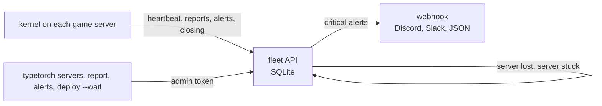

# Live servers and alerts

See every live server of your game, what each one did with a deploy, and get an alert when something breaks, within
seconds. The **kernel** sends it, so it keeps working when a build is broken and the game's own code doesn't run.

- Needs kernel 0.3.2+ in the place (a place project that maps the kernel's files one by one must map `Fleet` too; the
  template's `studio.project.json` does).
- Backend: the **fleet API**, a small server you host (SQLite inside). It is part of the
  [backend](https://github.com/typetorch/backend) and runs in the same process as its DuckDB analytics part, or alone.
- Without it everything else still works: `servers`, `report` and `alerts` say "not configured" in one line, and
  deploys skip their wait with a note.

## How it works



Each game server posts, with a write-only token:

| What | When |
|---|---|
| **Heartbeat** | every 30 s, and at once on a swap, a health change or a player count change. Branch, build, `#seq`, players, health (`ok`, `failed`, `unverified`, `degraded`), kernel version, uptime, last error |
| **Deploy report** | one per deploy outcome: `booted`, `swapped`, `failed`, `rolled_back` or `skipped`, with the error and the seconds it took |
| **Alert** | at once ([codes below](#alerts)) |
| **Closing notice** | when the server shuts down cleanly (so it isn't "lost") |

That is under about 6 requests a minute per server, capped at 30 (Roblox allows 500 a minute per server, shared with
your game). Failed posts are retried; a post never blocks a swap. The token is never logged.

**No MemoryStore for fleet data.** Heartbeats and reports never touch your experience's MemoryStore, whose quota your
game shares. (The kernel still keeps each branch's head there: one small key.)

## Set it up

`bun run typetorch init --phase backend` (CLI 0.10+) does steps 1 to 3 for you: on a VPS with Coolify, on a VPS
without Docker, or on your PC behind a quick tunnel. It makes the two keys, writes them to `.env`, and points the game
at the backend. The steps below do the same by hand.

1. **Run the backend.** On a VPS with a domain ([Deploy on Coolify](https://github.com/typetorch/backend#deploy-on-coolify)
   or [run it on a VPS without Docker](https://github.com/typetorch/backend#run-it-on-a-vps-without-docker)), or on your PC
   behind a quick tunnel for a test ([analytics quick start](analytics.md#quick-start-a-local-test)). For a game on
   Cloudflare Basin, run only its fleet part: `TYPETORCH_PARTS=fleet`. It needs two random values, 32+ characters each
   and different: the game key `TYPETORCH_API_KEY` and the admin token `TYPETORCH_ADMIN_TOKEN`.
2. **Give the CLI the keys.** In the game repo's `.env` (gitignored):

   ```text
   TYPETORCH_ADMIN_TOKEN=<admin token>
   TYPETORCH_API_KEY=<game key>
   ```

   The game key only writes; the admin token reads and manages. The CLI never prints them or passes them to a child process.
3. **Point game servers at it:**

   ```sh
   bun run typetorch backend setup --url https://backend.example.com
   ```

   It writes `backend` = `{ url, key }` (the game key) into the game's [signed settings record](settings.md), with the
   `fleet` and `analytics` sections that kernels before 0.4 read derived from it, and `"backend": { "url": ... }` into
   `typetorch.json`, then pings the servers and sends the owner list to the backend. It needs both prod signing keys (the record
   is signed; servers refuse one that doesn't verify) and kernel 0.3.8+. `--dry-run` shows what it would write;
   `bun run typetorch settings status` shows the record (the token hidden). Before it signs anything it
   [checks](settings.md#checked-before-it-is-signed) the address (https, `GET /healthz` within 5 s) and the game key (not
   the admin token) and refuses a broken one with a fix; `--force` writes anyway.
4. **Check:** kernels read the record at boot, about every minute, and within seconds of a ping. Join a server, then
   `bun run typetorch servers`.

## Commands

```sh
bun run typetorch servers
bun run typetorch servers --branch prod --watch
bun run typetorch report latest
bun run typetorch report "#42"
bun run typetorch alerts --since 120
bun run typetorch alerts --follow --level critical
```

- **`servers [--branch <b>] [--watch]`:** every live server: JobId, branch, build, applied `#seq`, health, players,
  kernel, uptime, last heartbeat. `--watch` redraws every 5 s. Reserved-server access codes are never shown.
- **`report <seq|artifact|latest> [--branch <b>]`:** what the servers did with one deploy: counts per result, errors
  grouped with the servers that hit them, and the servers still on an older `#seq`. It exits 1 when a server failed or
  rolled back, and prints the rollback command.
- **`alerts [--follow] [--level info|warning|critical] [--since <minutes>]`:** the last 60 minutes by default;
  `--follow` keeps printing new ones.
- **`deploy --wait`** reads the same reports: [Deploy and rollback](deploy-and-rollback.md#wait-and-automatic-rollback).

In PowerShell, quote `"#42"`.

## Alerts

| Code | Level | From | Means |
|---|---|---|---|
| `deploy_failed` | critical | kernel | a deploy didn't load or start on a server |
| `health_rollback` | critical | kernel | a new build failed its health window and the server went back to the last good one |
| `lkg_exhausted` | critical | kernel | nothing known-good could run after a failure |
| `backup_build` | critical | kernel | 0.3.6: nothing else could run, so the backup build baked into the place runs ([never an empty server](deploy-and-rollback.md#never-an-empty-server)) |
| `boot_failed_teleport` | critical | kernel | 0.3.6: nothing runs at all; players are being moved to another server |
| `bounce_kick` | critical | kernel | 0.3.6: a player was kicked after 3 moves (or failed teleports) |
| `client_failed` | warning | kernel | 0.3.6: a player's game code didn't start even after a re-send; they were moved |
| `health_failed`, `health_unverified` | critical | kernel | the server runs nothing, or booted an unverified prod build |
| `health_degraded` | warning | kernel | the running build keeps erroring, or a deploy failed here |
| `booted_unverified`, `no_trusted_head` | critical | kernel | [prod signing](prod-signing.md) problems at boot |
| `kernel_api_mismatch`, `artifact_refused` | critical | kernel | a build the kernel can't or won't run |
| `error_spike` | warning | kernel | 20 or more errors a minute from the running build |
| `refused_deploy`, `refused_head`, `refused_pin`, `refused_swap` | warning | kernel | the kernel refused a message or a swap (for example an unsigned one on prod) |
| `auto_rollback` | critical | CLI | `deploy --wait` rolled the branch back |
| `server_stuck` | warning | CLI and fleet API | servers didn't pick up a deploy (below) |
| `server_lost` | critical (3+ servers) or warning | fleet API | servers stopped reporting (below) |
| `fleet_flood` | critical | fleet API | too many never-seen JobIds in a minute (below) |

The kernel sends each code at most once a minute per server (`error_spike` every 5 minutes).

- **Server lost:** no heartbeat for 90 s and no closing notice. One alert per branch and build per sweep, with the
  JobIds; critical when 3 or more servers are lost at once.
- **Server stuck:** 3 minutes after a deploy started, live servers on its branch are still below its `#seq` and haven't
  reported anything for it. It lists them and says nothing about the build itself, so it never triggers a rollback.
- **Fleet flood:** the fleet API admits at most 2,000 JobIds it has never seen per minute (enough for a 1,250-server
  fleet restarting at once). Past that, new ones get a 429 until the minute ends (they get in on their next
  heartbeat), known servers keep working, and one `fleet_flood` alert is raised per minute. The cause is a huge fleet
  restart or someone with the ingest token sending made-up JobIds. Raise `TYPETORCH_NEW_JOBS_PER_MINUTE` for a bigger
  fleet.

Reports are kept 30 days and alerts 90 days.

## Webhooks

The fleet API can post alerts to Discord, Slack or any URL that takes JSON. In the backend's environment (Coolify's environment variables, or its env file):

```text
TYPETORCH_ALERT_WEBHOOK_URL=<your webhook URL>
TYPETORCH_ALERT_WEBHOOK_LEVELS=critical
```

- The format is detected from the URL (or set `TYPETORCH_ALERT_WEBHOOK_FORMAT` to `discord`, `slack` or `json`).
- Critical only by default (`TYPETORCH_ALERT_WEBHOOK_LEVELS=critical,warning` adds warnings).
- The same alert (code, branch, build) at most once per 10 minutes; at most 20 posts a minute.
- A webhook URL is a secret: keep it in the server's env file only.

The API also streams changes live (Server-Sent Events, `GET /v1/fleet/stream`, admin token) for your own tools; the
CLI polls for now.

## Debugging endpoints

Two backend routes answer most "what is going on?" questions in seconds. Both take the admin token as
`Authorization: Bearer <admin token>` (never the game key).

```sh
curl -s -H "Authorization: Bearer $TYPETORCH_ADMIN_TOKEN" "$URL/v1/fleet/servers?branch=prod"
curl -s -X POST -H "Authorization: Bearer $TYPETORCH_ADMIN_TOKEN" -H "Content-Type: application/json" \
  -d '{"sql": "SELECT count(*) FROM events WHERE t > epoch_ms(now()) - 600000"}' "$URL/v1/sql"
```

- **`GET /v1/fleet/servers?branch=&maxAge=`:** `{ servers, players, byArtifact, byHealth }`. Each server has `job`,
  `serverType`, `branch`, `channel`, `artifact`, `players`, `appliedSeq`, `generation`, `health`, `lastError`,
  `kernel`, `budget`, `tps`, `tpsMin`, `memMb`, `luaMb`, `startedAt` and `ageSeconds` (since the last heartbeat). It is
  what `typetorch servers` prints, with more fields. `GET /v1/fleet/servers/<job>/metrics?since=<unix ms>` is one
  server's TPS and memory history.
- **`POST /v1/sql`** (DuckDB server, analytics part): `{ "sql": "...", "limit"?: n }`, one read-only `SELECT` or `WITH`
  over the views `events` and `recordings` (every day file plus today's live rows), at most 10,000 rows. The answer is
  `{ columns, rows, truncated, ms }`. `TYPETORCH_SQL=0` turns it off (404). It answers "is anything arriving?" long
  before a chart does.
- There is no `/v1/branches` or `/v1/registry` (404). Branch heads and the deployment history are in the CLI:
  `typetorch branch ls` and `typetorch deployments` ([the deployment log](deploy-and-rollback.md#the-deployment-log)).

## In game: Manage > Servers

The dev menu's server list (owners) doesn't use the fleet API or any storage. When you open it, your server asks every
server over MessagingService (a roll call), collects the answers for 3 s and caches the list for 15 s. Each server
answers with the same status the kernel sends as its heartbeat. See [The dev menu](dev-menu.md#manage). Game code gets
the same list, with public fields only, from [`TypeTorch.servers()`](messaging.md#the-server-list).

## In the dev menu

Server > Status shows these when the kernel's sender has a problem:

| Attention item | Fix |
|---|---|
| No fleet API | the place's kernel lacks its `Fleet` module: map it in your place project (kernel 0.3.2+), then publish |
| Fleet settings | the settings record's `backend` is invalid: run `backend setup` again |
| Settings | the [settings record](settings.md) is missing, unsigned or doesn't verify (`typetorch settings status`) |
| Fleet API failing | the URL doesn't answer (a stopped server, a restarted quick tunnel) or the token is wrong |

## History

The fleet API is the live view. The [AnalyticsEngine](analytics.md) also forwards each server's status and deploy
reports as `fleet` rows (option `fleet`, on by default), so the analytics queries `servers` and `deployReport` can
look back further.
